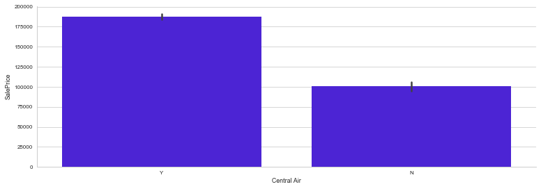

# AmesHousingData

Ames housing data is about individual home sales in Ames, IA from year 2006 to 2010.

## Objective

Predict home sale price by analyzing,cleaning,feature engineering(if necessary) and modeling the provided csv dataset. There are two datasets:
1. train.csv
  . This csv includes all 80 features that will be used in modeling to predict a home sale price
2. test.csv
  . This dataset will be used to test the accuracy of model built using data in train.csv dataset

## Data Description

There are 80 features (columns) in the training data set. Data dictionary for the data set is linked [here](http://jse.amstat.org/v19n3/decock/DataDocumentation.txt)

## Data Analysis

1. Import required libraries
2. Data exploration
3. Clean up data
4. Feature engineering
5. Model creation
6. Evaluate model metrics
7. Conclusion

## Data exploration  

###### A graphical look at data because a pciture is worth thousand words

1. Almost an equal split between numeric and non-numeric data types in the data set.
2. More than 1600 rows for features 'Alley', 'Pool QC', 'Fence', 'Misc Feature' have missing data. Which is a high number by any measure, as shown by the chart below.    

  

3. Other features have missing values too but that is something we can address in some way later on during data exploration. 

4. Co-relation between 'SalePrice' and rest of numeric features in the data set.  

  

5. House square feet vs sale price scatter plot.  

  

6. Year house was built vs SalePrice.  

  

7.House sale price distribution.  

 

8.House sale price distribution after applying log transformation.  

 

7.House sale price box plot with mean and median plotted. Mean is the solid line in the box while median is dashed line.  

   

8. Sale price of house vs if a house has central AC or not.  

    

9. Sale price of house vs kitchen quality of the house.   

    

9. Sale price of house vs exterior quality of the house.  

      

9. Sale price of house vs home quality of the house.  

    

## Data cleanup  

1. Drop 'Alley', 'Pool QC', 'Fence', 'Misc Feature' as more than 1600 rows for each feature have missing data.  
2. Drop 'PID','MS SubClass','Misc Val','Enclosed Porch','Fireplace Qu','3Ssn Porch' columns as these columns do not have a strong correlation with the sale price.
3. Drop houses whose square footage is more than 5000 as those rows are clearly outliers wrt square footage and the sale price. A 5500 sq ft house sold for only $160,000  
  

4. Mssing values were replaced by either median of that feature or by relying on bbfill/fffill approach.

## Feature engineering

1. Convert all ordinal features into numeric using following conversion rule 'Ex':5,'Gd':4,'TA':3,'Fa':2,'Po':1. Eight ordinal features such as Exterior Quality, Garage Quality etc were converted to numeric using this approach.  

2. Engineer a new feature 'HouseAge' as difference of 'YearSold' and 'YearBuilt'.  

3. Engineer a new feature 'TotalBath' as sum of 'Full Bath' and 'Half Bath'.  

4. Engineer a new feature 'Bsmt Total Bath' as sum of 'Bsmt Full Bath' and 'Bsmt Half Bath'.  

5. Update 'GrLivArea' feature values wherever it was not equal to the sum of '1st Flr SF and '2nd Flr SF'.  

6. Lastly create a new dataframe that includes all the numeric feature plus the engineered features to use for model creation and analysis.   

## Model creation

#### In order to predict house sale price we will rely on creating a LinearRegression model. 
#### Linear regression formula states that 
### $$
\begin{eqnarray*}
\textbf{y}&=& {\beta}_0&+&{\beta}_1&*& x_1&+&{\beta}_2&*& x_2 \\
\end{eqnarray*}
$$
##### where **y** is the predicted variable. In our case this is the sale price of the house
##### and **x_1,x_2,......x_n** are the co-efficients or the independent variables or the features in our data set

###### Steps for model creation

1. For model creation and evaluation we are using `sklearn` library.  

2. Create an instance of `LinearRegression` object.  

3. Split the input data into X and y test and train sets using `sklearn test_train_split()`.  

4. Fit the model using `X_train` data set by.  

5. Predict sale price by using the test data set.  

6. Evalualte `R2` scores for `train` and `test` data.  

7. Generate cross validation metrics using  `sklearn` `cross_val_score` and `cross_validate`.  

## Evaluate model metrics

1. The basic metric of `LinearRegression` model evaluation is `R2` scores. In my case `R2` scores were  

  

Score for training set is lower than test set which indicates a model that is udnerfitting the test data and has high bias and low variance. Though the difference between two scores is not much but nonetheless they are apart.

2. Cross validation score for train and test using default cross validation of 5.  

  

3. A snapshot of a cross fold data set that plots house sale price for the training data set.

   

